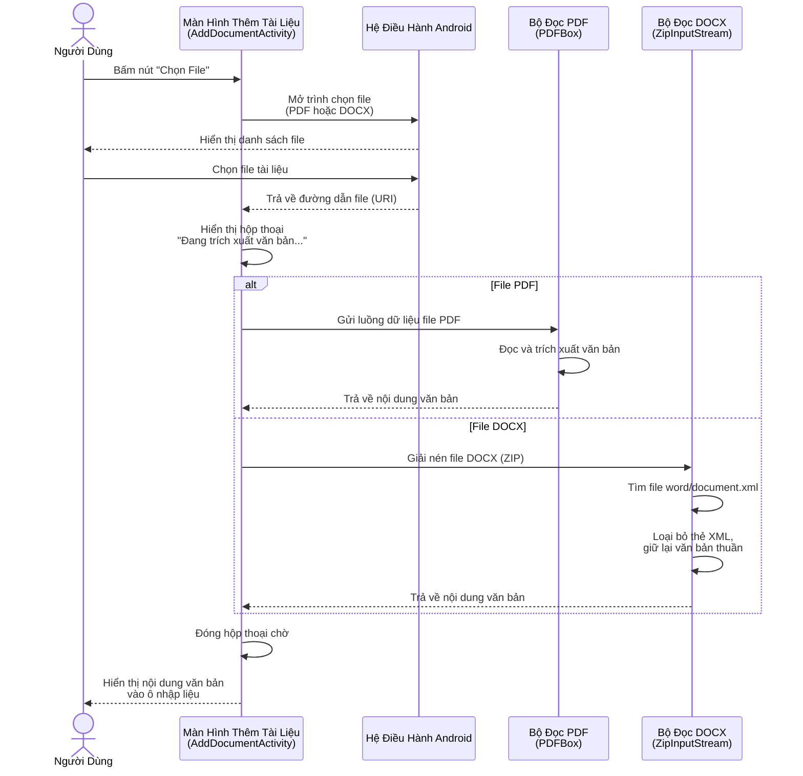
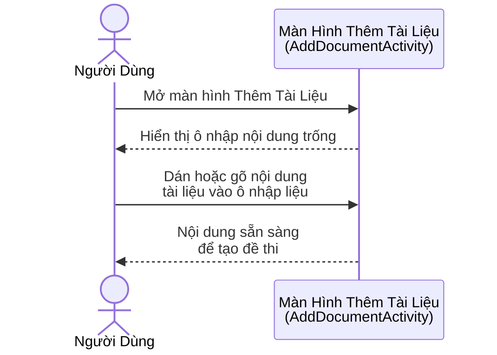
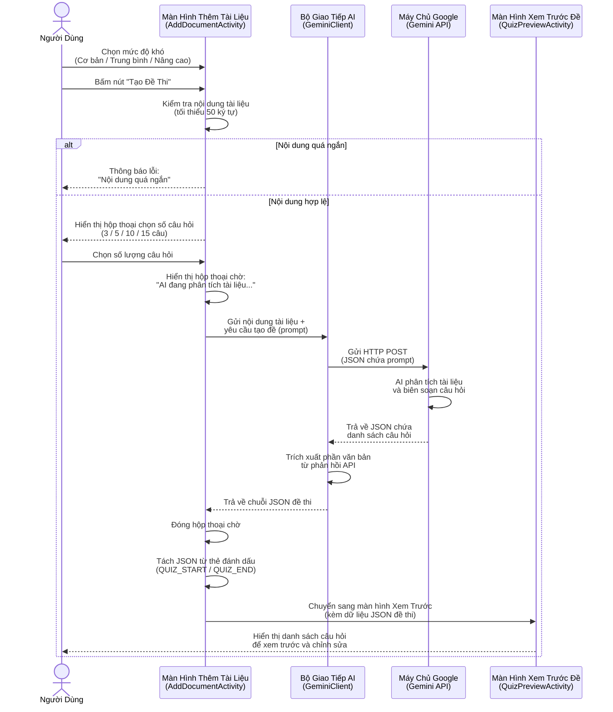
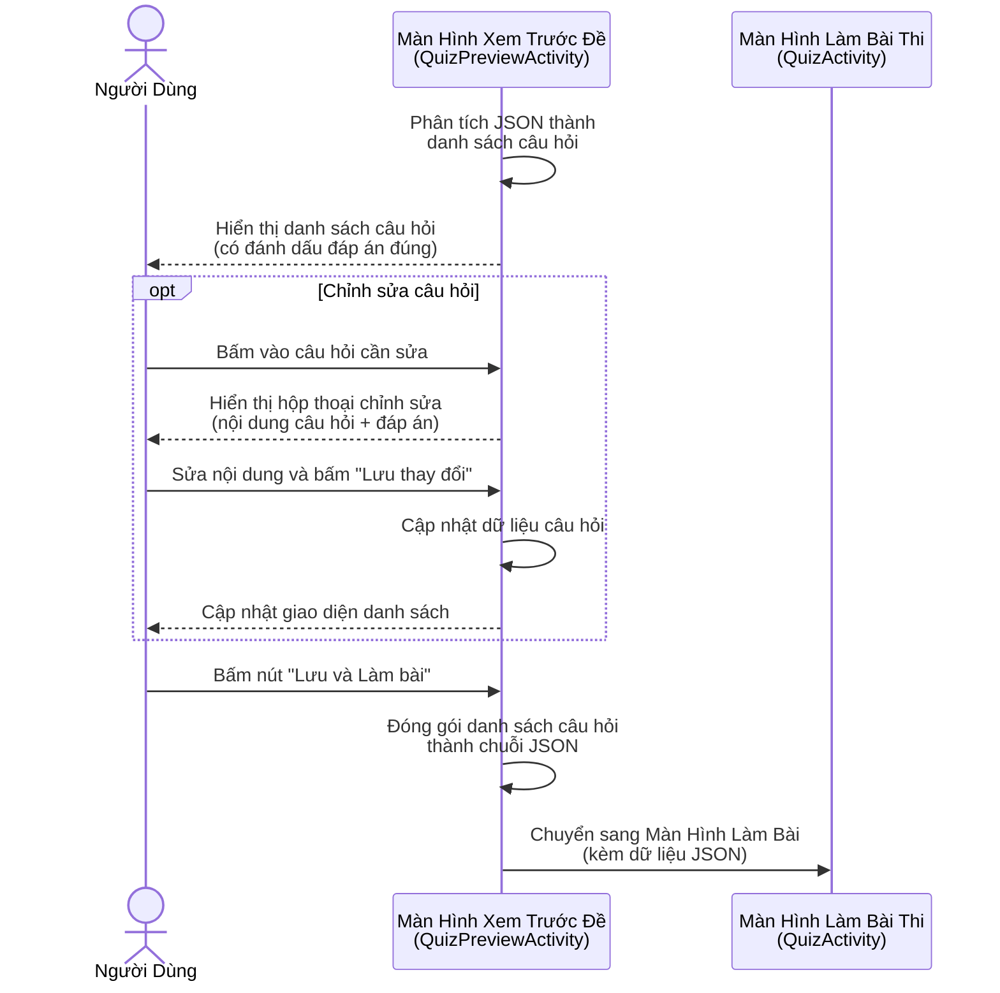
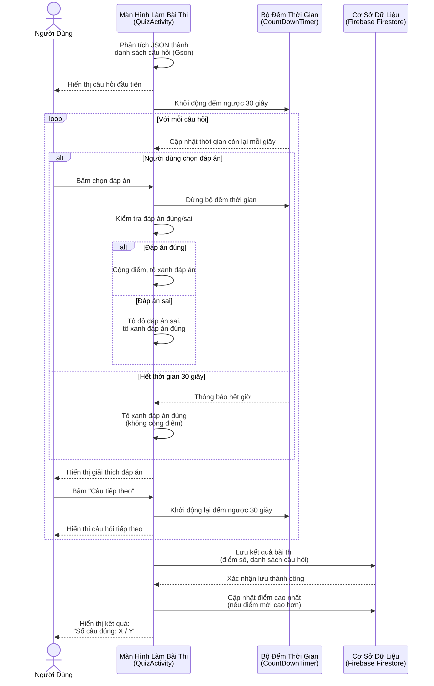
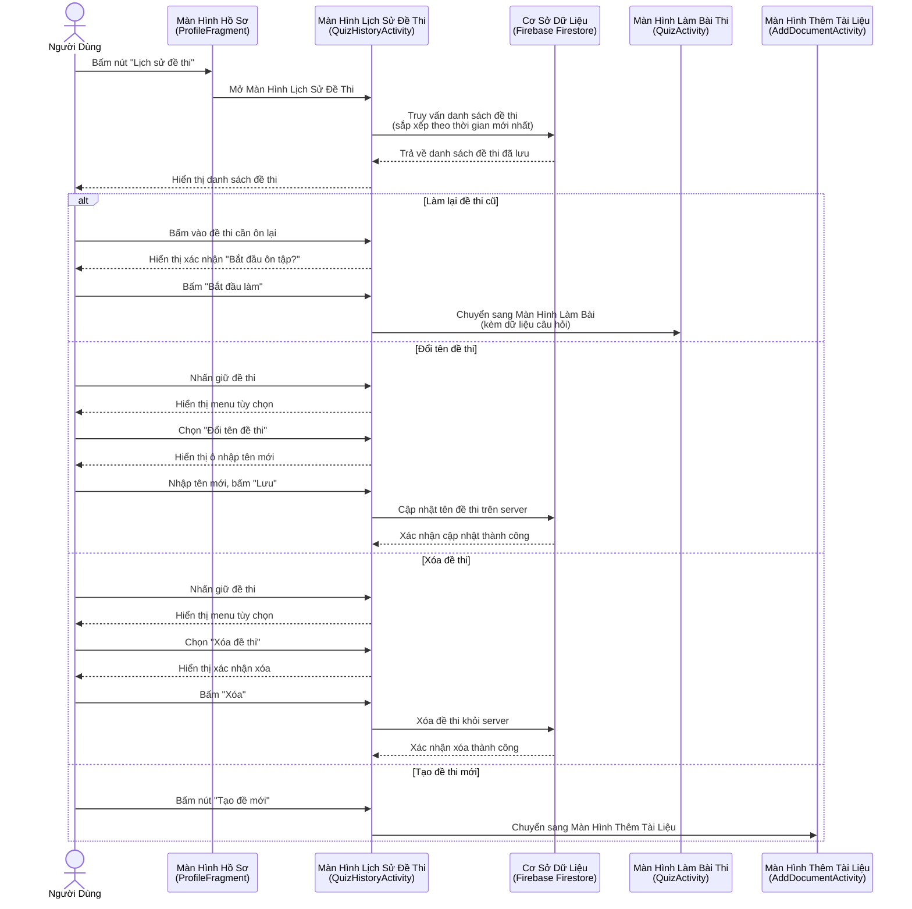

# Sơ Đồ Tuần Tự (Sequence Diagram)

## 1. Chức năng Quản Lý Tài Liệu

### 1.1. Tải lên tài liệu (Upload file PDF/DOCX)

### 1.2. Nhập tài liệu thủ công (Dán text trực tiếp)

---

## 2. Chức năng Tạo Đề Thi

### 2.1. Tạo đề thi tự động từ tài liệu

### 2.2. Xem trước và chỉnh sửa đề thi

### 2.3. Làm bài thi trắc nghiệm

### 2.4. Quản lý lịch sử đề thi

